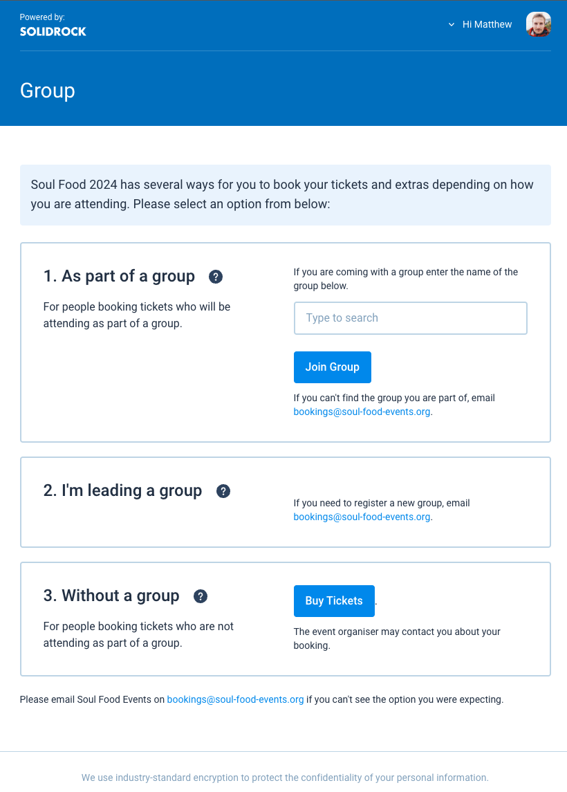
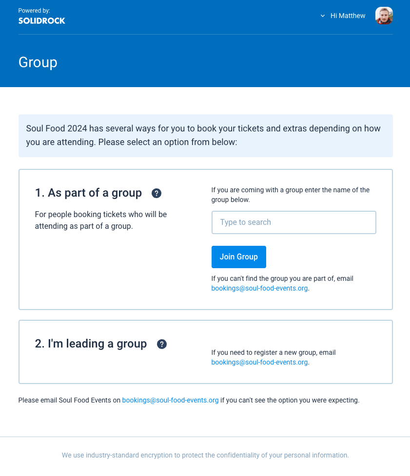
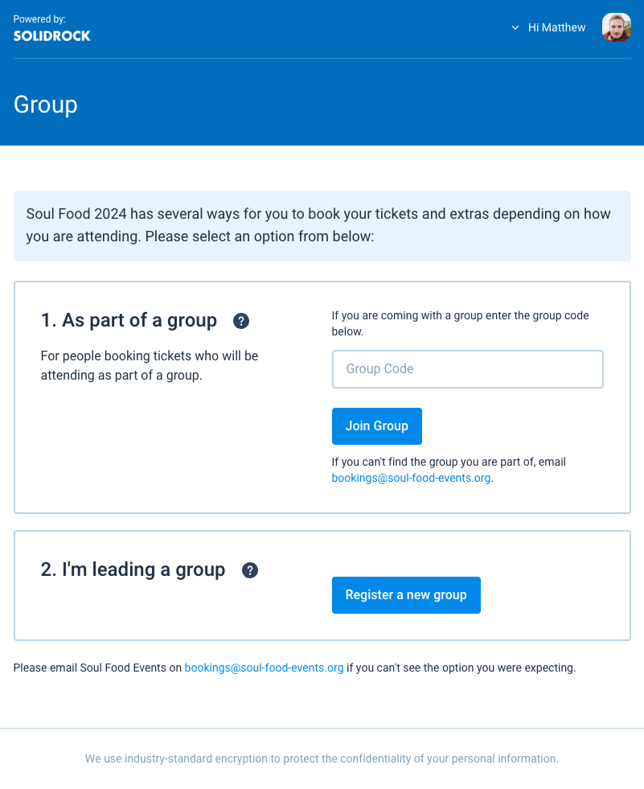
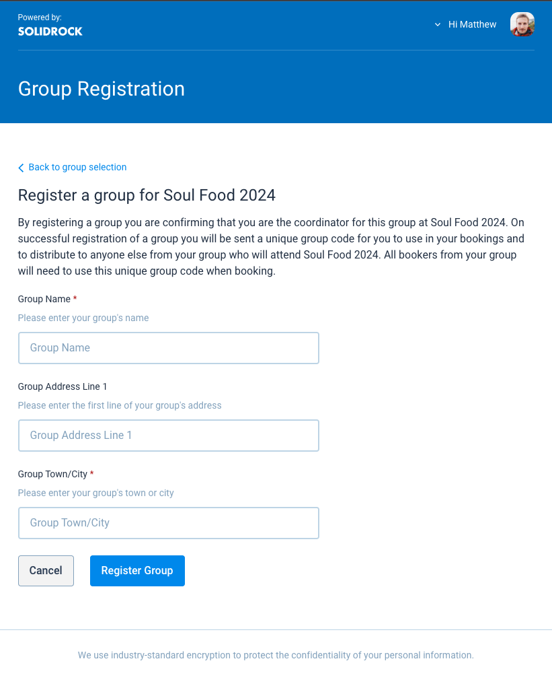

# Events

## General Information

### Event Name

The event name is shown in multiple places across the Solidrock Booking System but primarily within the frontend booking experience for delegates. They will see this within the event summary cards if your event is set to `public`, on the event landing page and within email communications (such as invoices and receipts) regarding your event.

### Slug

The event slug is what appears in the unique Solidrock URL for your event. Typically, the event slug would be similar to the event name, but must follow URL encoding principles such that it would predominantly contain alphanumeric characters and hyphens. By way of example if the event slug was set to `our-amazing-event` and our [organisation slug](/guide/organisations.md#slug) was set to `mega-events`, the frontend landing page for this event would be reachable at `https://events.solidrock.io/mega-event/our-amazing-event`.

::: warning
Once a slug has been set for an event it **cannot** be changed in the future.
:::

### Event Description

The description is where you'd explain in as much or as little detail as you desire what your event is and other key information a person booking in might need to know ahead of starting an order. The description is shown on the frontend event landing page.

::: tip
You can add simple text formatting to the description text, such as **bold** _italic_ and links by highlighting the text within the description field.
:::

### Event Image

The event image is shown within event summary cards and on the frontend landing page for the event. The image you upload should be high resolution (at least 2000px wide), but no more than 4MB (megabytes) in size. Images can be PNG, JPG or GIF.

::: tip
To avoid any automated cropping taking place on the image it should be uploaded at 16:9 aspect ratio. This is especially important if your image has text or other critical details embedded in it.
:::

### Start Date

This is the start date and time of the event itself. Typically, the date that delegates can start to arrive for your event.

### End Date

This is the end date and time of the event and is usually the date and time delegates must leave the event.

### Timezone

Set the timezone for your event start date.

### Digital Event Streaming

If your event is an online or digital event, or has a digital component, you can turn this option on to gain access to further content settings for the digital part of your event. The new area will appear in the sidebar called '[Digital Event](/guide/digital-events.md)'.

From this new area you will be able to create a page, restricted by login using a ticket ID, to stream video content and provide details for other content available online, for example links to hidden content, digital meetings and so on.

### Status

The event status offers a few options:

1. **Offline:** The event is _not_ accessible by anyone from the frontend. Anyone trying to access the booking process for this event will be instructed that bookings are closed.
2. **Public:** The event _is_ accessible by any member of the public from the frontend. The event will also appear on the main [event listing page](https://events.solidrock.io/events).
3. **Private:** The event _is_ accessible by any member of the public so long as they have the specific website URL for the event. The event will not be listed on the main event listing page.
4. **Cancelled:** The event has been cancelled and is no longer accessible for people to book in. Any person trying to access the event frontend will be instructed that the event has been cancelled, and they should contact the event organiser for more information.

## Contact Information

The event contact information is specifically related to the event which may be different to the contact information for your organisation. The address in particular should be the location of the event.

### Email Address

The event email address will be made available to those booking in for the event if they need to make an enquiry.

### Website

This is the full URL (including the _https://_) of the website that provides complete information about the event.

### Address

This is the address for the event location. If your event is not in-person (i.e. it's a digital only event) you can leave all of these fields empty.

### Hide Event Map

If an event address has been set a map will be shown on the event landing page to provide a clearer indication of the event location for those wishing to book in. If you'd prefer this map was not shown, you can toggle this setting on.

## Booking Information

### Order Reference Prefix

The order reference prefix is a 4 character, alphanumeric string that will begin every dynamically created, unique order reference. For example if the prefix is set to `AB12` then orders within this event would look something like `AB122k20`, `AB12abcd` or `AB12m3g4`.

::: warning
Once the prefix has been set, and bookings made for the event, it **cannot** be updated
:::

### Bookings Open Date

This date and time signals when bookings can be made through Solidrock for this event. It can be set in the future or the past. The [event status](/guide/events.md#status) must also be set to something other than `Offline` for people to access the booking process.

### Bookings Close Date

This date and time signals when bookings close through Solidrock for this event. Once this date/time is reached anyone trying to access the booking process will be instructed that bookings for this event are now closed.

### Booking Editing Cutoff Date

This date and time signals when bookings can no longer be edited for this event. Under some circumstances details associated with tickets and extras within a booking can be edited after it has been paid for. Once this date/time is reached the booker will no longer be able to make any changes and must contact the event organiser to make further changes, subject to the event terms & conditions and discretion of the organiser.

### Terms & Conditions

If your event has Terms & Conditions that everyone making a booking must agree to please select them from this dropdown. [Terms & Conditions](https://events.solidrock.io/admin/terms-conditions) can be shared across multiple events, so they are created/uploaded [here](https://events.solidrock.io/admin/terms-conditions) ahead of selecting them for the event.

### Unassigned Tickets Allowed?

By default, nobody is allowed to purchase tickets that are missing required data, for example, the name of the person the ticket is assigned to.

You may change this option, to allow either Group Coordinators, everyone or nobody to purchase unassigned or incomplete tickets.

::: warning
Team Member type tickets will **always** require the ticket form to be completed, regardless of this setting.
:::

::: tip
You can change this event setting at any point.
:::

### Who can edit tickets after they're paid for?

By default, nobody is allowed to edit the details associated to tickets and extras once they have been purchased. For example, editing the name of the delegate.

You may change this option, to allow either Group Coordinators, everyone, or nobody, to edit ticket details on completed, paid for orders.

::: warning
This setting works in conjunction with the **Booking Editing Cutoff Date**, after which nobody will be able to edit any details.
:::

::: tip
You can change this event setting at any point.
:::

### Custom Ticket Instructions

This text will appear at the top of the ticket selection page during the frontend bookings flow. You can use this text to convey important booking information.

### Custom Extra Instructions

This text will appear at the top of the extra selection page during the frontend bookings flow. You can use this text to convey important information about extras.

## Payment Options

This is where you set how people can pay for their bookings from the frontend. Supported payment methods include [Stripe](https://stripe.com) and bank transfer (BACs). As you may wish to have the same payment options (e.g. the same Stripe account, or Bank Account for transfers) used across multiple events you first set these up [here](https://events.solidrock.io/admin/payment-options).

When adding a payment option, you can choose to limit that option to only Group Coordinators by using the checkbox below the payment option dropdown.

### Refund Admin Fee

The Refund Admin Fee field is where you can set a specific baseline administrative fee for a payment option.

### Refund Fee Receipt Text

This text will appear alongside the fee amount in the refund receipt email as a description of the fees.

### Solidrock Charges & Fees

Use the at a glance calculator to get an understanding for how fees will break down and what you, the event organiser, would receive once the Solidrock and any card processing/transaction fees have been charged. You can set an event to handle the fees in one of two ways:

1. **Fees included within ticket & extra prices:** This is the default setting for fees. Under this option the Solidrock and card processing fees will be taken _out of_ the total cost of the order. For example a £100 order might have a 2% (£2) Solidrock fee deducted as well as a Stripe transaction fee (approximately 1.4%-2.9% if order paid by card). The customer would pay £100 and the event would receive in the region of £95.

2. **Fees are charged to the customer:** You can turn this option on which charges the customer the **Solidrock** fees on top of the order total. Using the same example as before, a customer would pay the £100 order total plus the £2 Solidrock fee. Stripe fees are always taken out of the final amount paid.

### Access Pass Image

The access pass image relates to the [Teams](/guide/teams/) area of an event within Solidrock. If you need to print out lanyards or passes for team members to wear at an event you can do so through Solidrock. This pass image becomes the background image/graphic for that printed pass that then has dynamic information (such as team member name, team name, access privileges etc.) overlaid on top.

The image you upload should be high resolution (at least 2000px wide), but no more than 4MB (megabytes) in size. Images can be PNG, JPG or GIF.

::: tip
Passes are printed at a portrait aspect ratio approximately 10:16. Images should therefore follow this same sizing ratio to prevent unexpected cropping results.
:::

### Team Opportunities Description

This description, which can have basic text formatting applied, is shown on the frontend event bookings pages for Team Member ticket types where a person is being asked to select which team(s) they would like to join. This field is optional and could be used to explain a little more about the team structure at your event.

::: tip
If your event doesn't require team members to be booked in through Solidrock you can leave this empty.
:::

### Team Times Description

As with the 'Team Opportunities Description', this is shown on the frontend event booking pages for Team Member ticket types where a person is being asked to select which team(s) they would like to join. This field is optional and could be used to explain a little more about how teams work across different time periods within your event. For example, you may have some teams needed for the event setup, some for while the event runs and some for post-event set-down.

::: tip
If your event doesn't require team members, or teams aren't required across multiple time periods, you can leave this empty.
:::

## Groups

Groups in Solidrock represent a collection of people or items (tickets and extras) that are associated. A group could be people from the same church, business, charity or club etc. Multiple bookings can be made by multiple different lead bookers but have the option to associate all the tickets and extras with the same group. A group coordinator (someone who manages or leads the group) would then be able to see all those who have been associated to their group.

Here's a demo outlining the configuration settings and booking process.

<iframe style="width: 100%;" height="365" src="https://www.youtube.com/embed/AV1dtwo_OVg" title="YouTube video player" frameborder="0" allow="accelerometer; autoplay; clipboard-write; encrypted-media; gyroscope; picture-in-picture; web-share" allowfullscreen></iframe>

### Does this event have groups?

If your event has groups as described above, toggle this option on the further refine how groups are managed for the event. With this option turned off there will be no opportunity for a booker to register a group or assign their tickets and extras to an existing group.

### Must tickets have a group assigned?

If all tickets for your event must be assigned to a group, turn this option on. Bookers will be required to assign a group to their tickets before being able to check out and complete their booking.

### Must extras have a group assigned?

If all extras for your event must be assigned to a group, turn this option on. Bookers will be required to assign a group to their extras before being able to check out and complete their booking.

### Can Group Coordinators download all tickets for their groups?

If enabled, Group Coordinators will be able to download all tickets associated with their group(s) from their 'My Groups' profile page. This is useful for those events where a group coordinator may need to print out tickets on behalf of their group members.

### Are public group registrations allowed?

If you want to allow booker to register their own groups you can enable this option.

**When enabled**, bookers will be required to enter a unique group code to assign their tickets and extras to a group. The person who registered the group initially (the 'Group Coordinator') will have access to this unique code that they can distribute to those coming with their group.

**When disabled**, the only way groups can be registered is by an event administrator from the [Groups](https://events.solidrock.io/admin/groups) area. Bookers will then be able to search for and select a group by name to assign to their tickets and extras.

### Which set of groups should be used for this event?

A group will always exist as part of a set. Your set of groups might be named 'Businesses', 'Youth Groups', 'Churches', 'Event Name 2024' and so on as a way to differentiate some groups from others and whether a set of groups is to be used across multiple events of should be for a single specific event only. Within this dropdown all previously created sets of groups will be listed as well as an option to 'Generate new set' which, if selected, will create a group based on the event name.

Any publicly registered groups will be created within the set selected here.

### Custom Group Instructions

This text will appear at the top of the group selection page during the frontend bookings flow. You can use this text to convey important booking information related to groups.

### Group Adult to Child Ratio Enabled?

If enabled, this setting will require you to set a ratio value for the number of child tickets (any tickets calculated as being for under 18s) to adult tickets (any tickets calculated as being for 18s+). This is useful for events where there are specific ratios of adults to children that must be adhered to for safeguarding purposes.

### Group Adult to Child Ratio Value

This is the ratio value that will be used to calculate the number of adult tickets required for a given number of child tickets within a group. For example, if the value is set to 10, then for every 10 child tickets purchased, at least 1 adult ticket must also be associated with the group.

### Groups with only adults check?

If your event expects both adults and children to be present within groups, enabling this option will allow you see which groups have only adults in them.

---

### Example Configurations

Hre are some examples of what lead bookers would see based on the following group configurations.

#### #1. Event has groups, but not required for tickets/extras. No public group registrations.

{data-zoomable}

#### #2. Event has groups, group required for tickets/extras. No public group registrations.

{data-zoomable}

#### #3. Event has groups, group required for tickets/extras. Public group registrations enabled.

{data-zoomable}

Group registration form.

{data-zoomable}

## Emails

### Receipt Organiser Text

Alongside all the standard order receipt information (such as a summary of the order tickets and extras purchased and total amounts paid or due) you can use this field to provide some custom information from you the event organiser.

::: tip
This could be a thank-you message or links to your social media and website for more information.
:::

### Receipt Email Card Payment Text

Use this field to provide some custom text on the receipt email specifically to those who have paid by card.

### Receipt Email BACs Payment Text

Use this field to provide some custom text on the receipt email specifically to those who have opted to pay by bank transfer (BACs). You may for example want to outline that the bank transfer description should contain the Solidrock order reference to enable you to easily match up the money in your account with the right order in Solidrock.

### Send Unassigned Ticket Reminder Email?

If enabled Solidrock will automatically send an email reminder notification to any lead booker who has one or more unassigned tickets (the ticket doesn't have all required form data filled in) within their booking(s) one week before the order edit cut-off date.

### Automatically Send Digital Tickets?

If enabled Solidrock will automatically send out the digital tickets to all lead bookers for their completed bookings on the date specified in the `Digital Ticket Delivery Date` field. For any bookings that are completed after this date they will immediately receive their tickets on completion and full payment of the order.

## Tracking

### Facebook Pixel

If you wish Solidrock to pass relevant data back to Facebook for your marketing and campaign purposes you can add a Facebook Pixel ID here. Find out where and how to create a [Facebook Pixel here](https://www.facebook.com/business/help/952192354843755?id=1205376682832142).
