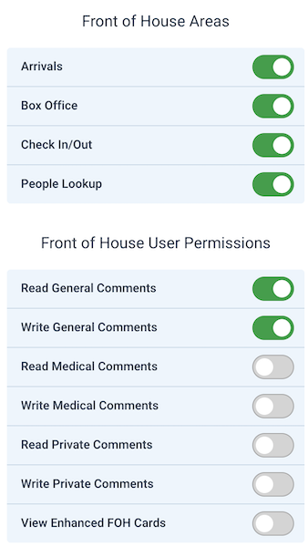

# Front of House - Managing Users

This area allows you to manage the users who can access the different Front of House features, such as Arrivals, Check In & Out, Box Office and Person Lookup.
To access this area you need to be an Organisation Admin or a Front of House Admin.

## Adding FOH Users

To add a new user, click on the "Add Front of House User" button. You will need to provide the following information:
-  **First Name**: The first name of the user.
-  **Last Name**: The last name of the user.
-  **Email Address**: The email address of the user you want to add.

If the details provided do not match an existing user, a new user will be created with the provided details. 
An invitation email will be sent to the user, allowing them to set their password and access the Front of House features.

The user, whether newly created or existing, will be given the 'Front of House User' account type, along with the selected permissions.

## Editing Users

To edit an existing user, click on the cog icon within their card. 
From the pop-up modal, you can change the permissions given. 

## Permissions

The permissions available for Front of House users are:

### Area Access
- **Arrivals**: Allows the user to manage event arrivals.
- **Check In & Out**: Allows the user to manage venue check-in and check-out.
- **Box Office**: Allows the user to manage box office sales.
- **Person Lookup**: Allows the user to search for and view ticket information.

### Other Permissions
#### Timeline Comments
There are currently 3 different types of timeline comments that can be associated with tickets:
- **General**: General comments that can be added to tickets.
- **Medical**: Comments related to medical information or requirements for the ticket holder.
- **Private**: Comments that require more security and privacy, such as sensitive information about the ticket holder, or disclosures, for example.

For each type of comment, you can choose to allow the user to read or write that type of comment.
The permissions are independent, so you can allow a user to read medical comments but not write them, for example.

If a user has not been given permission to read a specific type of comment, they will only see that someone has left a comment of that type. 
They will not see the content of that comment. 

#### Enhanced Card View
In the form builder, you can optionally choose to display extra custom form fields in the person lookup card view.
If a user has been given the "View Enhanced FOH Cards" permission, they will be able to see these extra fields in the person lookup card view.

### Default Permissions
By default, when a new user is created, they will have the following permissions:
{data-zoomable}

## Removing Permissions
If you have revoked permissions from a user, they will no longer be able to access the Front of House features associated with those permissions.

If the user happens to be on a page that they no longer have access to, they will be redirected to the Front of House landing page either when they try to perform an action, or after the next page update for pages that automatically refresh content, such as the Arrivals page or Box Office.