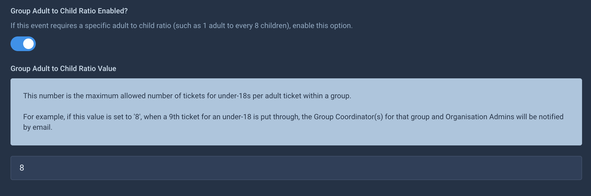
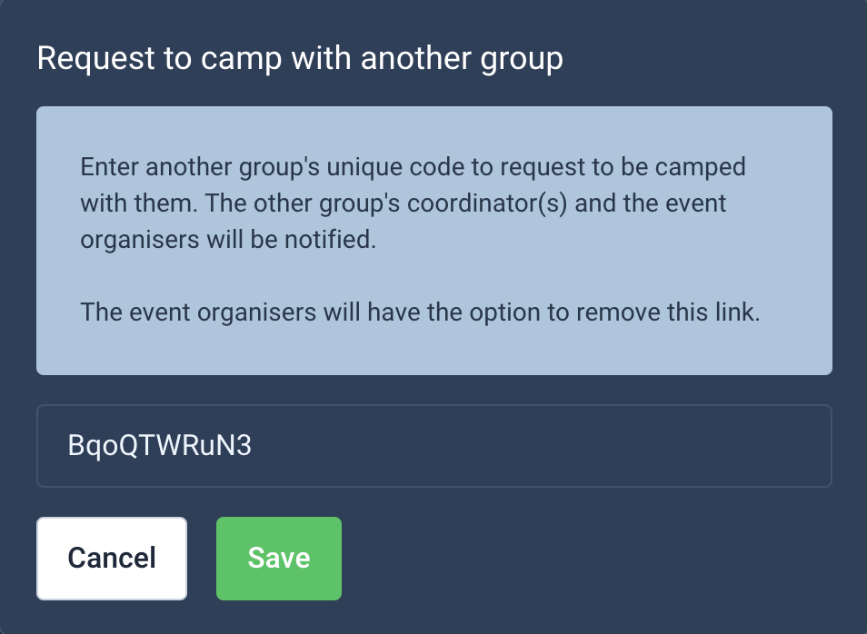
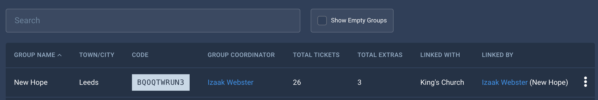

# Groups

Groups in Solidrock represent a collection of people or items (tickets and extras) that are associated. A group could be people from the same church, business, charity or club etc. Multiple bookings can be made by multiple different lead bookers but have the option to associate all the tickets and extras with the same group. A group coordinator (someone who manages or leads the group) would then be able to see all those who have been associated to their group.

## Group Sets

[Group sets](https://events.solidrock.io/admin/groups) act as a collection of groups. Each event can be assigned a group set in which all groups registered for that event will reside. You might call your group set based on the event name such as `Mega Event 2024 Groups` or something that better defines the types of groups in it like `Youth Groups`, `2024 Churches` and so on.

Group sets can be unique to a given event or be re-used across multiple events if the groups are similar or likely to be present at them. Re-using a group set will reduce the need for some groups to re-register.

## Group Items

Group items are the individual groups themselves within a group set. Organisation Administrators can create and manage groups including:

-   Group Name
-   Unique Code (will automatically generate a unique code if left empty)
-   Office Email Address
-   Office Telephone Number
-   Website
-   Address
-   Status:
    -   Unlisted: Not available to be joined
    -   Listed: Available to be joined and discoverable by search when 'Public Group Registration' is disabled.
    -   Publicly Registered: Set when the group has been registered by a lead booker instead of an Organisation Administrator.

### Public Group Registration

Public Group Registration is set per event within [event settings](/guide/events.md#groups).

#### Enabled

This option when enabled allows lead bookers to register their own groups (providing the Group Name and Town/City). Once registered, the lead booker becomes a Group Coordinator (more on this below) and is provided the automatically generated unique group code to then use in their bookings, or to distribute to others who will be booking and need to associate their tickets and extras to the same group.

Enabling this option also requires that any bookings being associated to a group **must** use the group code to do so.

#### Disabled

With this setting disabled only Organisation Administrators can register groups at the request of group leaders/coordinators and would need to register a Solidrock account with the `Group Coordinator` role, or add the role to an existing account.

Lead Bookers will be able to type to search for groups to choose from a list when assigning a group to their booking. All groups with a `Listed` status will be available to choose from.

:::tip
Having Public Group Registration disabled can be a good solution for those cases where it is important that there is greater moderation of the groups for an event or where there needs to be a relationship built with the group and its leaders.
:::

##### Over 18s Check
When the 'Show Over-18 check?' setting is enabled for your event, a checkbox will be shown on the Public Group Registration form.
This checkbox will need to be checked when registering a group to confirm the user registering the group is over 18.

## Group Coordinators

A Group Coordinator is any group leader or administrator for a group. They may or may not be attending the event themselves. 
In Solidrock any account can be given the [Group Coordinator account type](/guide/accounts/account-types#group-coordinator) which wil allow them to view all tickets and extras assigned to their group(s) for each event.

### Importing Group Coordinators
Using the 'Import Group Coordinators' button on the Group Coordinators page for your event, you'll be able to import any Group Coordinators from another event that uses the same group set.
When you do this, any Group Coordinators that are not already part of the event you're managing will be copied across.

### Removing Group Coordinators
From the Group Coordinators page, you can use the triple-dot menu to see a 'Remove Group Coordinator' option. 
This will prompt you to confirm the removal of the Group Coordinator for this event.

## Group Ratios

If you wish to have a notification go out to Group Coordinators when the ratio between child tickets and adult tickets reaches a certain point, you can set up the group ratios setting.
This setting is a whole number value for the amount of child tickets allowed per adult ticket. 

:::warning
This limit is a soft limit and does not prevent further orders being placed for the group.
:::

### Setup

Firstly, to enable this ratio and set a ratio limit, you will need to enable the 'Group Adult to Child Ratio Enabled?' lightswitch within the 'Groups' tab of the event settings form.

Once that has been enabled, a second settings field called 'Group Adult to Child Ratio Value'. This is where you'll enter the required limit of child tickets.
For example if you want the notification to be sent out when within a group there are 10 child tickets for each adult ticket, enter the value of "10".

### Reaching the Limit

When a limit is hit, the group coordinators for the group in question will be notified, by email, that their group has hit the limit.

The email sent will contain a link to the Group Coordinator's profile area, where they can see the group's tickets for the event.
This page can be used to track the amount of children attending the event for the group and to track the adult tickets, should more be needed.

Also within the Group Coordinator's 'My Groups' area, there will be a displayed alert message whenever a group is over the limit.
This alert will contain links to the groups that are in breach of the group ratio limit and display the current ratio of tickets for those groups.

## Group Linking

Groups can now link themselves together within an event. This can be useful if groups are wanting to camp with one another, for example.
A group coordinator can use the 'Link to Group' button from their group ticket list for an event, before entering the unique group code for the group they wish to link to.

Once the group code is entered and saved, the system will link the groups and display any links in the Group Coordinator's group tickets page and on the Group List page for Organisation Admins.
The table will show who linked the group as well as the group they linked to.

An Organisation Admin can remove these links from the action menu in the Group List table.