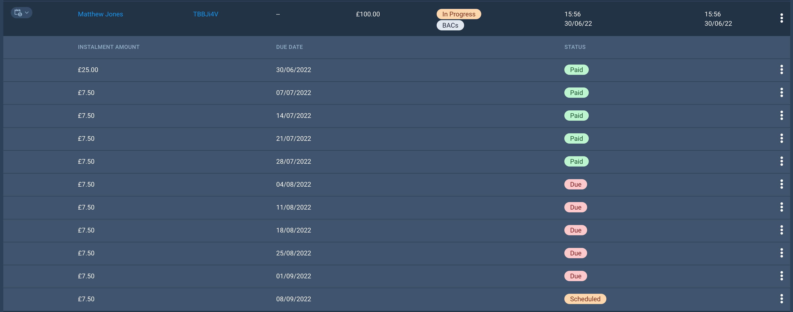
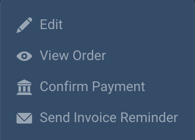
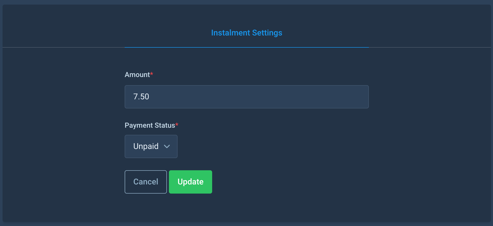

# Payment Plans - Instalments

## Checkout & Deposit
At the checkout, a Lead Booker will be able to select any available payment plan. When a plan is selected, the payment button will update to the value of the payment plan's deposit amount.
Once the deposit payment has been successfully taken, the remaining instalments will be created for that order and the Lead Booker will receive their receipt email, listing out the remaining instalments.

### Order Payment Status
After the deposit for an order has been taken, the order's payment status will be changed to In Progress. It will remain as this until all the instalments have been paid, at which point the payment status will be updated to Paid.

## Viewing Instalments
As an Organisation Admin, you can view a list of instalments for an order in the Order List page. Any orders in this list that have instalments will have a small instalment icon in the left-hand column. Clicking this icon will show/hide the instalments for that specific order, including the instalment amount, due date and the payment status for that instalment.

As an Organisation Admin, you can also view all instalments for your event using the new Instalments page, listed under the 'Bookings' section of the left-hand event menu.
This page is searchable and filterable, and will list every instalment for the event, including the following details:
- Order Reference
- Lead Booker Name
- Instalment Amount
- Payment Status
- Due Date

As a Lead Booker, you can view instalments for an order through the [My Bookings](https://events.solidrock.io/admin/profile/my-bookings) page within your profile area. For any 'In Progress' orders, using the triple-dot menu on the right, select 'Show Instalments'.
If the order was made using a card, you'll also have the option to pay for the next due instalment using the triple-dot menu within an instalment row.

:::tip
If a Lead Booker has multiple due instalments, they will only be able to pay for the first due instalment initially. Once that instalment has been paid, they will then have access to pay for the next due instalment.
:::

## Updating an instalment
Within the Order List, when showing the instalments for an order using a payment plan, you'll see the option in the triple-dot menu to edit an instalment. From the following form, you'll be able to update the amount of the instalment and the payment status of the instalment.

:::warning
If you update the amount of an instalment, any **future** instalments for this order will also be updated to keep the total order value correct.
:::

If an order has entered a payment plan using BACs, this is where an Organisation Admin would confirm the instalment as paid, once the invoice for the instalment has been paid.

